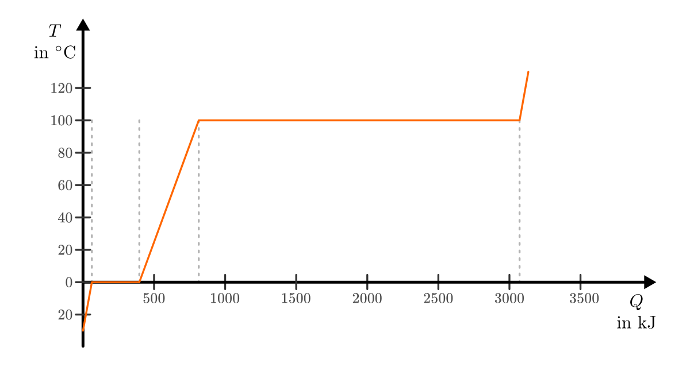
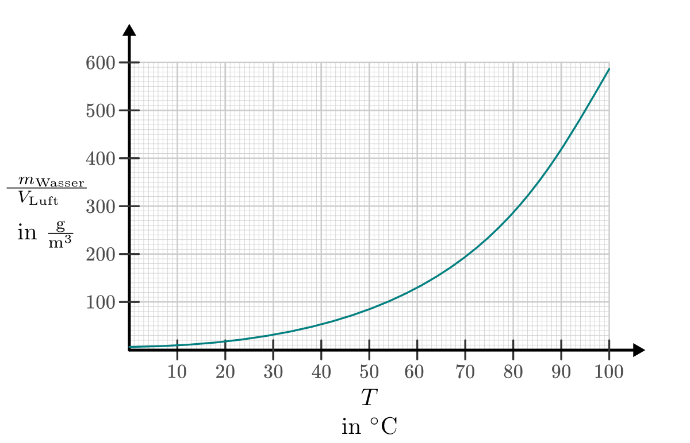
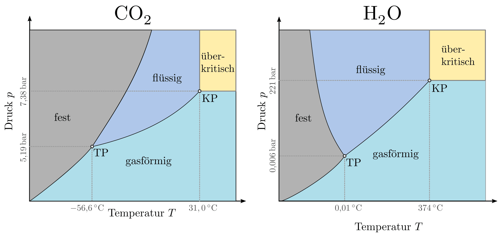

.. index:: Wärmekapazität
.. _Wärmekapazität und Phasenübergänge:

Wärmekapazität und Phasenübergänge
==================================

Wärme kann als eine Energieform aufgefasst werden. Führt man in einem isolierten
System einem Gegenstand eine Wärmemenge :math:`Q` zu, so erhöht sich dessen
Temperatur :math:`T`. Eine Voraussetzung dafür ist allerdings, dass sich der
Aggregatzustand des Gegenstands während der Wärmezufuhr nicht ändert, also kein
:ref:`Phasenübergang <Phasenübergänge>` (Schmelzen, Verdunsten, Sublimieren)
stattfindet.

.. _Wärmekapazität:
.. _Wärmemenge und Wärmekapazität:

Wärmemenge und Wärmekapazität
-----------------------------

Wie viel Wärme bei einem konkreten Gegenstand für eine bestimmte Erwärmung nötig
ist, hängt vom Material des Gegenstands und seiner Masse ab: Eine Tasse Wasser
benötigt für eine gleiche Erwärmung wesentlich weniger Energie als ein ganzes
Schwimmbad. Die Menge an Wärme, die man einem konkreten Gegenstand der Masse
:math:`m` zuführen muss, um ihn um :math:`\Delta T = \unit[1]{K}` zu erwärmen,
wird als Wärmekapazität :math:`C` des Gegenstands bezeichnet; ihre Einheit ist
:math:`\unit{\frac{J}{K}}`. Für die zur Erwärmung nötige Wärmemenge :math:`Q` gilt:

.. math::

    \Delta Q = C \cdot \Delta T

.. _Die spezifische Wärmekapazität:

.. rubric:: Die spezifische Wärmekapazität

Um Gegenstände aus unterschiedlichen Materialien hinsichtlich ihrer
Wärmekapazität vergleichen zu können, gibt man die materialspezifische
Wärmekapazität üblicherweise bezogen auf ein Kilogramm des jeweiligen Materials
an.

*Definition*:

    Die Menge :math:`\Delta Q` an Wärme, die nötig ist, um
    :math:`m=\unit[1]{kg}` eines Stoffes um :math:`\Delta T = \unit[1]{K}` zu
    erwärmen, wird als spezifischen Wärmekapazität :math:`c` bezeichnet:

    .. math::
        :label: eqn-spezifische-waermekapazitaet

        c = \frac{C}{m} = \frac{\Delta Q}{m \cdot \Delta T}

    Die Einheit der spezifischen Wärmekapazität ist gemäß der obigen Formel
    :math:`\unit[1]{\frac{J}{kg \cdot K}}`.

*Beispiele:*

* Um :math:`m = \unit[1]{kg}` Wasser um :math:`\Delta T = \unit[1]{K}` zu
  erwärmen, sind :math:`\Delta Q = \unit[4182]{J} \approx \unit[4,2]{kJ}` an
  Wärme nötig.

* Eisen benötigt je Kilogramm nur  :math:`\Delta Q = \unit[452]{J} \approx
  \unit[0,45]{kJ}`, um eine Erwärmung von einem Kelvin zu bewirken. Es hat damit
  (wie alle bekannten Stoffe) eine deutlich kleinere spezifische Wärmekapazität
  als Wasser.

.. list-table:: Spezifische Wärmekapazitäten verschiedener Stoffe
    :name: tab-spezifische-waermekapazitaeten
    :widths: 50 50

    * - Stoff
      - Wärmekapazität :math:`c` in :math:`\unit[]{\frac{kJ}{kg}}`
    * - Aluminium
      - :math:`0,90`
    * - Blei
      - :math:`0,13`
    * - Eis
      - :math:`2,10`
    * - Eisen
      - :math:`0,45`
    * - Ethanol
      - :math:`2,43`
    * - Holz (trocken)
      - :math:`\approx 1,5`
    * - Kupfer
      - :math:`0,38`
    * - Petroleum
      - :math:`2,14`
    * - Quecksilber
      - :math:`0,14`
    * - Silber
      - :math:`0,24`
    * - Wasser
      - :math:`4,18`
    * - Wolfram
      - :math:`0,13`
    * - Zinn
      - :math:`0,23`

.. _Spezifische Wärmekapazität bei Gasen:

.. rubric:: Spezifische Wärmekapazität bei Gasen

Bei Gasen hängt die spezifische Wärmekapazität von der Art der Erwärmung ab.
Je nachdem, ob während der Erwärmung der Druck :math:`p` oder das Volumen
:math:`V` konstant gehalten wird, unterscheidet man zwischen den
Wärmekapazitäten :math:`c_{\mathrm{p}}` und :math:`c_{\mathrm{V}}`:

* Die spezifische Wärmekapazität :math:`c_{\mathrm{V}}` eines Gases gibt an,
  wie viel Energie zur Erwärmung eines Kilogramms um ein Grad nötig ist, wenn
  das Volumen des Gases konstant bleibt. Die zugeführte Wärmemenge führt
  ausschließlich zu einer Erhöhung der mittleren Energie der Moleküle.

* Die spezifische Wärmekapazität :math:`c_{\mathrm{p}}` eines Gases gibt an, wie
  viel Energie zur Erwärmung eines Kilogramms um :math:`\Delta T = \unit[1]{K}`
  nötig ist, wenn der Druck des Gases konstant bleibt. Die zugeführte Wärmemenge
  erhöht hierbei einerseits die mittlere Energie der Moleküle, andererseits muss
  auch eine so genannte "Ausdehnungsarbeit" am Gas verrichtet werden.

Ein gute Modellvorstellung hierfür liefert ein kubischer Gasbehälter, der nach
oben durch einen beweglichen Kolben abgeschlossen ist. Auf dem Kolben wird ein
Gewicht angebracht, das den Kolben so weit nach innen drückt, bis durch die
Kompression des Gases ein entsprechend großer  Gegendruck entsteht. Der durch
das Gewicht bewirkte Kolbendruck ist dann mit dem Gasdruck im Gleichgewicht.

.. figure:: ../pics/waermelehre/spezifische-waermekapazitaet-gase.png
    :name: fig-spezifische-waermekapazitaet-gase
    :alt:  fig-spezifische-waermekapazitaet-gase
    :align: center
    :width: 50%

    Erwärmung von Gasen bei konstantem Volumen (links) und konstantem Druck
    (rechts).

    .. only:: html

        :download:`SVG: Spezifische Wärmekapazität von Gasen
        <../pics/waermelehre/spezifische-waermekapazitaet-gase.svg>`

Bei einer Erwärmung mit konstantem Volumen wird der Kolben bei dieser Anordnung
nach oben hin mit zwei Bolzen fixiert, so dass sich das Gas auch bei zunehmender
Temperatur nicht ausdehnen kann. Ohne Fixierung hingegen kann sich das Gas
hingegen nach oben hin ausdehnen, bis sich wiederum ein Gleichgewicht zwischen
dem Kolben- Gasdruck einstellt.

Dehnt sich das Gas bei konstantem Druck :math:`p` um das Volumen :math:`\Delta
V` aus, so gilt für die vom Gas verrichtete Ausdehnungsarbeit:

.. math::
    :label: eqn-ausdehnungsarbeit

    p \cdot \Delta V = \frac{F}{A} \cdot \Delta V

Hat der kubische Gasbehälter die Seitenlänge :math:`s`, so gilt :math:`A = s^2`,
und :math:`V = s^3`. Insgesamt ergibt sich also :math:`p \cdot \Delta V = F
\cdot \Delta s`, was mit der Definition der :ref:`Arbeit <Mechanische Arbeit>`
übereinstimmt.

.. Enthalpie als Summe aus innerer Energie und Produkt aus Druck und Volumen:
.. U + p \cdot V

Allgemein gilt für beliebige Gase stets :math:`c_{\mathrm{p}} > c_{\mathrm{V}}`,
da bei konstantem keine Energie für die Ausdehnung des Gases zugeführt werden
muss. Bei konstantem Druck steht der Anteil der zugeführten Energie, der zur
Verrichtung der Ausdehnungsarbeit benötigt wird, nicht für die Erwärmung des
Gases zur Verfügung, es muss also mehr Energie für eine gleiche Erwärmung
investiert werden.

Bei Flüssigkeiten ist die Wärmeausdehnung wesentlich geringer als
bei Gasen, so dass hierbei häufig nur ein :math:`c`-Wert angegeben wird.

..
    In der Chemie, in der eher gleiche Stoffmengen als gleiche Massen betrachtet
    werden, ist auch die so genannte molare Wärmekapazität als Vergleichsgrösse
    üblich; sie wird in der Einheit :math:`\unit[]{J/(mol \cdot K)}` angegeben.

.. index:: Mischungsvorgang
.. _Mischungsvorgänge:

Mischungsvorgänge
-----------------

Bei Mischungsvorgängen in einer isolierten Umgebung wird vom wärmeren Körper
genauso viel Wärme abgegeben, wie vom kälteren Körper aufgenommen wird. Dies
gilt für Festkörper, Flüssigkeiten und Gase gleichermaßen. Dieser Sonderfall des
Energieerhaltungssatzes wird auch `Richmannsche Mischungsregel
<https://de.wikipedia.org/wiki/Richmann>`__  bezeichnet:

.. math::

   - Q_{\mathrm{abgegeben}} &= Q_{\mathrm{aufgenommen}} \\
   - m_1 \cdot c_1 \cdot (T_{\mathrm{M}} - T_1) &= m_2 \cdot c_2 \cdot
     (T_{\mathrm{M}} - T_2)

Mit :math:`T_{\mathrm{M}}` wird die Mischungstemperatur bezeichnet, die sich
nach dem Mischungsvorgang ergibt. Die Vorzeichen der Wärmebilanz ergeben sich
daraus, dass aufgenommene Wärmemengen der Konvention nach positiv gezählt,
abgegebene Wärmemengen hingegen negativ gewertet werden. Auf beiden Seiten
wurden in der obigen Gleichung die Wärmemengen dann mittels der Formel
:eq:`eqn-spezifische-waermekapazitaet` für die spezifische Wärmekapazität
ausgedrückt. Die linke Seite der Gleichung kann etwas umgestellt werden, indem
das Minus-Zeichen in die Klammer übernommen wird:

.. math::

   m_1 \cdot c_1 \cdot (-T_1 + T_{\mathrm{M}}) &= m_2 \cdot c_2 \cdot
   (T_{\mathrm{M}} - T_2) \\
   m_1 \cdot c_1 \cdot (T_1 - T_{\mathrm{M}}) &=  m_2 \cdot c_2 \cdot
   (T_{\mathrm{M}} - T_2)

Diese Gleichung kann nach der gesuchten Größe :math:`T_{\mathrm{M}}` aufgelöst
werden. Dazu werden beide Seiten der Gleichung ausmultipliziert und anschließend
sortiert:

.. math::

   m_1 \cdot c_1 \cdot T_1 - m_1 \cdot c_1 \cdot T_{\mathrm{M}} &= m_2 \cdot
   c_2 \cdot T_{\mathrm{M}} - \cdot m_2 \cdot c_2 \cdot T_2 \\
   m_1 \cdot c_1 \cdot T_1 + m_2 \cdot c_2 \cdot T_2 &= m_1 \cdot
   c_1 \cdot T_{\mathrm{M}} + \cdot m_2 \cdot c_2 \cdot T_{\mathrm{M}} \\

Auf der rechten Seite der Gleichung kann :math:`T_{\mathrm{M}}` ausgeklammert
werden; für die Mischtemperatur ergibt sich damit folgende Formel:

.. math::
    :label: eqn-mischtemperatur

    T_{\mathrm{M}} = \frac{m_1 \cdot c_1 \cdot T_1 + m_2 \cdot c_2 \cdot
    T_2}{m_1 \cdot c_1 + m_2 \cdot c_2}

Haben die Wärme austauschenden Körper eine gleiche Wärmekapazität, so kann diese
im Zähler sowie im Nenner ausgeklammert und gekürzt werden. Damit vereinfacht
sich die Formel folgendermaßen:

.. math::

    T_{\mathrm{M}} = \frac{m_1 \cdot T_1 + m_2 \cdot T_2}{m_1 + m_2}

Man kann an dieser Formel erkennen, dass bei gleichen Wärmekapazitäten die
Massenanteile :math:`\frac{m_1}{m_{\mathrm{ges}}}` und
:math:`\frac{m_2}{m_{\mathrm{ges}}}` Gewichtungsfaktoren für die Mischtemperatur
sind: Eine große Masse von :math:`m_1` (im Vergleich zu :math:`m_2`) führt zu
einer Verschiebung der Mischtemperatur in Richtung von :math:`T_1`. Sind die
Wärmekapazitäten der gemischten Substanzen verschieden, so treten diese
zusätzlich als Gewichtungsfaktoren auf.

.. _Kalorimeter:

Sind mehr als zwei Gegenstände beziehungsweise Substanzen am Mischungsvorgang
beteiligt, so müssen die dabei umgesetzten Wärmemengen ebenfalls berücksichtigt
werden. Allgemein gilt somit:

.. math::
    :label: eqn-mischungsformel

    c_1 \cdot m_1 \cdot T_1 + c_2 \cdot m_2 \cdot T_2 + \ldots = T_{\mathrm{M}}
    \cdot (c_1 \cdot m_1 + c_2 \cdot m_2 + \ldots)

Mittels der obigen Formeln kann experimentell wahlweise die spezifische
Wärmekapazität eines Gegenstands oder seine Anfangstemperatur bestimmt werden.
Isolierte Anordnungen, die zu genau diesem Zweck konstruiert sind, heißen
Kalorimeter.

.. index:: Phasenübergang
.. _Phasenübergänge:

Phasenübergänge
---------------

In welchem Zustand ein Stoff vorliegt, hängt von seiner Temperatur und dem Druck
seiner Umgebung ab. Je nachdem, wie groß die thermische Bewegungsenergie der
einzelnen Teilchen gegenüber der Stärke ihrer Bindungen mit den Nachbarteilchen
ist, können (fast) alle Stoffe als fest, flüssig oder gasförmig vorkommen. [#]_

Wechsel zwischen den drei Aggregatzuständen fest, flüssig und gasförmig werden
als Phasenübergange bezeichnet.

.. figure:: ../pics/waermelehre/phasenuebergaenge.png
    :width: 80%
    :align: center
    :name: fig-phasenuebergaenge
    :alt:  fig-phasenuebergaenge

    Teilchenmodell von Festkörpern, Flüssigkeiten, und Gasen sowie
    Phasenübergänge zwischen den drei Aggregatzuständen.

    .. only:: html

        :download:`SVG: Phasenübergänge
        <../pics/waermelehre/phasenuebergaenge.svg>`

.. index:: Phasenübergang; Schmelzen und Erstarren
.. _Schmelzen und Erstarren:

Schmelzen und Erstarren
^^^^^^^^^^^^^^^^^^^^^^^

Wird ein fester Körper erwärmt, so schwingen seine Teilchen immer stärker um
ihre Ruhelage. Zu einem bestimmten Zeitpunkt reichen die im Körper wirkenden
Kohäsionskräfte nicht mehr aus, um die Teilchen an ihre Plätze zu binden -- der
Festkörper schmilzt.

Wird einer Flüssigkeit Wärme entzogen, so geht sie bei einer bestimmten
Temperatur wieder in den festen Aggregatzustand über. Dieser Vorgang heißt
Erstarren.

Grundsätzlich gilt für beliebige Schmelz- und Erstarrungsvorgänge:

* Wärme, die einem Festkörper während des Schmelzens zugeführt wird, ist zum
  Aufbrechen der Festkörper-Strukturen nötig und steht somit nicht für eine
  Temperaturerhöhung zur Verfügung. Die Temperatur bleibt während des
  Schmelzvorgangs stets konstant.

* Die Schmelz- und Erstarrungstemperatur eines Stoffes sind identisch. Ebenso
  sind die zum Schmelzen nötige beziehungsweise die beim Erstarren frei werdenden
  Wärmemengen (Schmelzenergie beziehungsweise Erstarrungsenergie) identisch.

.. todo::

    Siehe Tabelle... Schmelzenergie Eis 335 J / g.

Die meisten Körper dehnen sich beim Schmelzen aus und ziehen sich beim Erstarren
zusammen (Ausnahme: :ref:`Die Anomalie des Wassers <Anomalie des Wassers>`).

.. list-table:: Schmelztemperaturen verschiedener Stoffe bei Normaldruck :math:`\unit[(1013)]{hPa}`
    :name: tab-schmelztemperaturen
    :widths: 50 50

    * - Stoff
      - Schmelztemperatur in :math:`\unit{\degree C}`
    * - Aluminium
      - :math:`660`
    * - Blei
      - :math:`327`
    * - Eis
      - :math:`0`
    * - Eisen
      - :math:`1530`
    * - Kupfer
      - :math:`1083`
    * - Quecksilber
      - :math:`-39`
    * - Silber
      - :math:`960`
    * - Wolfram
      - :math:`3380`
    * - Zinn
      - :math:`232`

..  Legierungen weisen einen tieferen Schmelzpunkt auf als die einzelnen
..  Bestandteile.

Manche Stoffe, beispielsweise Glas, haben keine bestimmte Schmelztemperatur:

* Glas erweicht bei :math:`\unit[700]{\degree C}` und wird bei
  :math:`\unit[1\,300]{\degree C}` dünnflüssig. Man kann Glas als eine
  Flüssigkeit ansehen, die bei Zimmertemperatur äußerst zäh ist. [#]_
* Andere Stoffe, beispielsweise Holz, verbrennen, wenn man sie an Luft stark
  erwärmt.

.. index:: Schmelzwärme
.. _Schmelzwärme:

.. rubric:: Die Schmelzwärme

Um einen bestimmten Feststoff zum Schmelzen zu bringen, muss ihm eine
entsprechende Wärmemenge zugeführt werden. Die Menge an Wärme ist von der
Art des Stoffs und seiner Masse abhängig.

*Definition:*

    Die spezifische Schmelzwärme :math:`q_{\mathrm{s}}` eines Materials gibt an, welche
    Wärmemenge :math:`Q` nötig ist, um ein Kilogramm des Stoffes bei seiner
    Schmelztemperatur zu schmelzen:

    .. math::

        q_{\mathrm{s}} = \frac{\Delta Q}{m}

Die spezifische Schmelzwärme wird üblicherweise in :math:`\unit[kJ]{kg}`
angegeben. Beim Erstarren wird die gleiche Menge an Wärme wieder an die Umgebung
abgegeben.

.. list-table:: Schmelzwärmen verschiedener Stoffe
    :name: tab-schmelzwaermen
    :widths: 50 50

    * - Stoff
      - Schmelzwärme :math:`q_{\mathrm{s}}` in :math:`\unit{\frac{kJ}{kg}}`
    * - Aluminium
      - :math:`397`
    * - Blei
      - :math:`23`
    * - Eis
      - :math:`344`
    * - Eisen
      - :math:`277`
    * - Kupfer
      - :math:`205`
    * - Quecksilber
      - :math:`12`
    * - Silber
      - :math:`105`
    * - Wolfram
      - :math:`192`
    * - Zinn
      - :math:`60`

.. index:: Phasenübergang; Sieden und Kondensieren
.. _Sieden:
.. _Kondensieren:
.. _Sieden und Kondensieren:

Sieden und Kondensieren
^^^^^^^^^^^^^^^^^^^^^^^

Wird ein flüssiger Stoff auf seine Siedetemperatur erhitzt, so bewegen sich die
Flüssigkeitsteilchen mit sehr großer Geschwindigkeit. Sie können dadurch die
Kohäsionskräfte überwinden. Innerhalb der Flüssigkeit entstehen Dampfblasen, der
Stoff geht in den gasförmigen Aggregatzustand über. Dabei muss Wärme zugeführt
werden.

Wird Dampf Wärme entzogen, so geht er bei einer bestimmten Temperatur wieder in
den flüssigen Aggregatzustand über. Dieser Vorgang heißt Kondensieren.

* Während des Siedens ändert sich die Temperatur des Körpers trotz
  Wärmezufuhr nicht.

* Die Siedetemperatur und Kondensationstemperatur eines Stoffes sind identisch.

.. list-table:: Siedetemperaturen verschiedener Stoffe bei Normaldruck :math:`\unit[(1013)]{hPa}`
    :name: tab-siedetemperaturen
    :widths: 50 50

    * - Stoff
      - Siedetemperatur in :math:`\unit{\degree C}`
    * - Aluminium
      - :math:`2450`
    * - Blei
      - :math:`1750`
    * - Eisen
      - :math:`2735`
    * - Ethanol
      - :math:`78`
    * - Kupfer
      - :math:`2590`
    * - Meerwasser
      - :math:`104`
    * - Quecksilber
      - :math:`357`
    * - Silber
      - :math:`2180`
    * - Wasser
      - :math:`100`
    * - Wolfram
      - :math:`5500`
    * - Zinn
      - :math:`2690`

.. index:: Verdampfungswärme

.. _Verdampfungswärme:

.. rubric:: Die Verdampfungswärme

Um eine bestimmte Flüssigkeit zum Sieden zu bringen, muss ihr -- ebenso wie beim
Schmelzen -- eine entsprechende Wärmemenge zugeführt werden. Die Menge an Wärme
ist wiederum von der Art der Flüssigkeit und ihrer Masse abhängig.

*Definition:*

    Die spezifische Verdampfungswärme :math:`q_{\mathrm{v}}` einer Flüssigkeit gibt
    an, welche Wärmemenge :math:`Q` nötig ist, um ein Kilogramm der Flüssigkeit
    bei ihrer Siedetemperatur zu verdampfen:

    .. math::

        q_{\mathrm{v}} = \frac{\Delta Q}{m}

Beim Kondensieren wird die gleiche Menge an Wärme wieder an die Umgebung
abgegeben.

.. list-table:: Verdampfungswärmen verschiedener Stoffe
    :name: tab-verdampfungswaermen
    :widths: 50 50

    * - Stoff
      - Verdampfungswärme :math:`q_{\mathrm{v}}` in
        :math:`\unit{\frac{kJ}{kg}}`
    * - Aluminium
      - :math:`10\,900`
    * - Benzol
      - :math:`394`
    * - Blei
      - :math:`8\,600`
    * - Eisen
      - :math:`6\,339`
    * - Ethanol
      - :math:`840`
    * - Kupfer
      - :math:`4\,790`
    * - Quecksilber
      - :math:`285`
    * - Silber
      - :math:`2\,350`
    * - Wasser
      - :math:`2\,257`
    * - Wolfram
      - :math:`4\,350`
    * - Zinn
      - :math:`2\,450`

Geht bei Sublimations- beziehungsweise Resublimationsvorgängen ein Stoff
unmittelbar von der festen in die gasförmige Phase über (oder umgekehrt), so ist
die spezifische Wärme gleich der Summe der Schmelz- und Verdampfungswärme des
jeweiligen Stoffs.

    Benötigte Energiemenge zur Erwärmung von :math:`m=\unit[1]{kg}` Wasser von
    :math:`\unit[-30]{\degree C}` (Eis) bis :math:`\unit[+130]{\degree C}`
    (Dampf).

    .. only:: html

        :download:`SVG: Diagramm Wärmezufuhr und Phasenübergänge
        <../pics/waermelehre/diagramm-waermezufuhr-phasenuebergaenge.svg>`

Anhand der Werte aus den Tabellen zur Schmelz- und Verdampfungswärme erkennt
man, dass für die Phasenübergänge große Mengen an Wärme zugeführt werden müssen.
Da sich die Temperatur während des Schmelzens und Siedens nicht ändert, nennt
man die bei Phasenübergängen umgesetzte Wärmemenge auch "latente Wärme".

.. index:: Phasenübergang; Verdunsten, Luftfeuchtigkeit
.. _Verdunsten:

Verdunsten
^^^^^^^^^^

Flüssigkeiten können bereits unterhalb ihrer Siedetemperatur in den gasförmigen
Aggregatzustand übergehen. Beim Verdunsten müssen die Flüssigkeitsteilchen an
der Oberfläche die Kohäsionskräfte der anderen Teilchen überwinden. Das ist
möglich, weil sich nicht alle Flüssigkeitsteilchen mit der gleichen
Geschwindigkeit bewegen. Nur Teilchen mit großer Geschwindigkeit sind in der
Lage, die Flüssigkeit zu verlassen, wenn sie an die Oberfläche gelangen.

Die in der Flüssigkeit verbleibenden Teilchen haben eine geringere
durchschnittliche Geschwindigkeit als die verdunstenden; somit entschwindet beim
Verdunsten mit den schnellen, aus der Flüssigkeit entweichenden Teilchen auch
Wärme. Die verbleibende Flüssigkeit kühlt sich daher ab ("Verdunstungskälte").
[#]_

Das Verdunsten einer Flüssigkeit kann folgendermaßen beeinflusst werden:

* Je höher die Temperatur und je größer die Oberfläche, desto schneller
  verdunstet eine Flüssigkeit.
* Wird der entstehende Dampf fortgeführt, so verdunstet die Flüssigkeit
  ebenfalls schneller.

Ebenfalls relevant für den Verdunstungsvorgang ist die Dampfmenge in der
umgebenden Luft; im Fall von Wasserdampf spricht man von Luftfeuchtigkeit.

.. _Hygrometer:
.. _Luftfeuchtigkeit:
.. _Absolute Luftfeuchtigkeit:
.. _Relative Luftfeuchtigkeit:

Die Menge an Wasserdampf, die ein bestimmtes Volumen an Luft maximal aufnehmen
kann, ist stark abhängig von der Temperatur der Luft. Wie man an den Werten aus
der obigen Tabelle beziehungsweise am folgenden Diagramm sehen kann, nimmt
diese so genannte "Sättigungsmenge" mit der Temperatur überproportional zu.

.. list-table::
    :name: tab-luftfeuchtigkeit-saettigungsmenge
    :widths: 50 50

    * - Temperatur in :math:`\unit{\degree C}`
      - Sättigungsmgenge (Wasser) in :math:`\unit{\frac{g}{m^3}}`
    * - :math:`-15`
      - :math:`1,4`
    * - :math:`-10`
      - :math:`2,3`
    * - :math:`-5`
      - :math:`3,3`
    * - :math:`0`
      - :math:`4,9`
    * - :math:`5`
      - :math:`6,8`
    * - :math:`10`
      - :math:`9,4`
    * - :math:`15`
      - :math:`12,8`
    * - :math:`20`
      - :math:`17,3`
    * - :math:`25`
      - :math:`23,1`
    * - :math:`30`
      - :math:`30,3`
    * - :math:`40`
      - :math:`51,1`
    * - :math:`50`
      - :math:`82,8`

    Sättigungsmenge von Wasserdampf in Luft bei verschiedenen Temperaturen.

    .. only:: html

        :download:`SVG: Sättigungsmenge (Wasserdampf)
        <../pics/waermelehre/diagramm-saettigungsmgenge-von-wasser-in-luft.svg>`

Die "absolute" Feuchtigkeit von Luft gibt an, wie viel Gramm Wasserdampf aktuell
je Kubikmeter enthalten sind; die "relative" Luftfeuchtigkeit hingegen gibt
diesen Wert im Verhältnis zur beschriebenen Sättigungsmenge an. Da die absolute
Feuchtigkeit und der Sättigungsdruck jeweils in :math:`\unit{\frac{g}{cm^3}}`
angegeben werden, ist die relative Luftfeuchtigkeit dimensionslos; sie wird
üblicherweise in Prozent angegeben. Mit speziellen Messgeräten (so genannten
"Hygrometern") wird meist die relative Luftfeuchtigkeit gemessen.

*Beispiele:*

* In einem Volumen von :math:`V=\unit[1]{m^3}` ist bei einer Temperatur von
  :math:`T=\unit[20]{\degree C}` eine Wassermenge von :math:`\unit[10]{g}`
  enthalten. Wie hoch ist die relative Luftfeuchtigkeit?

  Die Sättigungsmenge an Wasserdampf bei :math:`T=\unit[20]{\degree C}` beträgt
  gemäß der obigen Tabelle beziehungsweise des obigen Diagramms ca.
  :math:`\unit[17]{\frac{g}{m^3}}`. Teilt man die angegebene absolute
  Luftfeuchtigkeit von :math:`\unit[10]{\frac{g}{m^3}}` durch diesen
  Sättigungswert, so erhält man eine relative Luftfeuchtigkeit von
  :math:`\frac{10}{17} \approx 59\%`.

* Wie viel Gramm Wasser sind in einem Raum :math:`l=\unit[5]{m}` langen,
  :math:`b=\unit[4]{m}` breiten und :math:`h=\unit[2,5]{m}` hohen Raum
  bei einer Temperatur von :math:`T_1=\unit[25]{\degree C}` und einer relativen
  Luftfeuchtigkeit von :math:`75\%` enthalten? Was passiert, wenn sich die
  Temperatur auf :math:`T_2=\unit[15]{\degree C}` abkühlt?

  Das Volumen des Raums beträgt :math:`V=\unit[(5 \cdot 4 \cdot 2,5)]{m^3} =
  \unit[50]{m^3}`; die Sättigungsmenge von Wasserdampf in Luft liegt bei einer
  Temperatur von :math:`\unit[25]{\degree C}` bei rund
  :math:`\unit[23]{\frac{g}{m^3}}`. Je Kubikmeter ist somit bei einer relativen
  Luftfeuchtigkeit von :math:`75\%` eine Menge von :math:`0,75 \cdot
  \unit[23]{g} = \unit[17,25]{g}` an Wasserdampf enthalten. Insgesamt enthält
  die Luft in dem Raum damit :math:`\unit[50]{m^3} \cdot
  \unit[17,25]{\frac{g}{m^3}} \approx \unit[862,5]{g}`.

  Nimmt die Temperatur der Luft ab, so sinkt auch die darin maximal mögliche
  Menge an Wasserdampf: Bei :math:`\unit[15]{\degree C}` beträgt die
  Sättigungsmenge nur noch rund :math:`\unit[13]{\frac{g}{m^3}}`. Da in der Luft
  jedoch :math:`\unit[17,25]{\frac{g}{m^3}}` enthalten sind, werden je
  Kubikmeter :math:`\unit[17,25-13]{g} = \unit[4,25]{g}` an Wasserdampf in Form
  von feinen Nebeltröpfchen kondensieren; insgesamt :math:`\unit[(50 \cdot
  4,25)]{g} = \unit[212,5]{g}`. Es wird folglich neblig, und die neue relative
  Luftfeuchtigkeit beträgt :math:`100\%`.

* Welche absolute Luftfeuchtigkeit hat Luft bei einer Temperatur von
  :math:`T_1=\unit[0]{\degree C}` und einer relativen Luftfeuchtigkeit von
  :math:`100\%`? Welche relative Luftfeuchtigkeit stellt sich ein, wenn diese
  Luft auf :math:`T_2=\unit[20]{\degree C}` erwärmt wird?

  Bei einer Temperatur von :math:`\unit[0]{\degree C}` beträgt die
  Sättigungsmenge an Wasserdampf knapp :math:`\unit[5]{\frac{g}{m^3}}`; da die
  Luft eine relative Luftfeuchtigkeit von :math:`100\%` hat, enthält sie eben
  diese Menge an Wasserdampf.

  Bei einer Temperatur von :math:`\unit[20]{\degree C}` beträgt die
  Sättigungsmenge hingegen rund :math:`\unit[17]{g}`. Die relative
  Luftfeuchtigkeit der Luft beträgt nach dem Erwärmen somit etwa
  :math:`\frac{5}{17} \approx 29,4\%`.

Wie das letzte Beispiel zeigt, kann auch bei kalter und nebliger Außenluft ein
kurzzeitiges Lüften ratsam, um die relative Luftfeuchtigkeit in einem Raum zu
senken. In Wohnräumen sind Luftfeuchtigkeiten zwischen :math:`40\%` und
:math:`70\%` üblich. Luftfeuchtigkeiten von unter :math:`25\%` und über
:math:`95\%` werden generell als unangenehm empfunden; in Gebäuden muss bei
einer konstanten Luftfeuchtigkeit von über :math:`80\%` mit Schimmelbildung
gerechnet werden. In gefährdeten Räumen kann diesem durch häufiges, kurzzeitiges
Lüften und/oder durch kontinuierliches Lüften mit Wärmerückgewinnung
("Wärmetauscher") vorgebeugt werden.

.. index:: Phasendiagramm
.. _Phasendiagramme:

Phasendiagramme
^^^^^^^^^^^^^^^

Phasendiagramme werden üblicherweise in so genannten Phasendiagrammen
dargestellt. In einem derartigen Diagramm werden die Existenzbereiche der
einzelnen Phasen einer chemischen Substanz in Abhängigkeit von der (absoluten)
Temperatur :math:`T` und dem vorherrschenden Druck :math:`p` für jeweils
dargestellt.

In einem Phasendiagramm sind die verschiedenen Bereiche, in denen jeweils nur
ein Aggregatzustand existieren kann, durch Linien voneinander getrennt. Entlang
der Linien kommt es zur so genannten Phasen-Koexistenz, in der jeweils zwei
Phasen gleichberechtigt nebeneinander existieren. In jedem Phasendiagramm sind
zudem zwei Punkte von besonderer Bedeutung:

* Der so genannte "Tripelpunkt" gibt ein Temperatur-Druck-Wertepaar an, bei dem
  alle drei Aggregatzustände (fest, flüssig und gasförmig) gleichzeitig
  nebeneinander existieren. Bei Wasser beispielsweise liegt der Tripelpunkt bei einer
  Temperatur von :math:`T=\unit[0,01]{\degree C}` und einem Druck von
  :math:`p=\unit[0,06]{bar}`.

* Der so genannte "Kritische Punkt" beschreibt das Ende der Siedepunktkurve,
  also der Linie zwischen dem flüssigen und gasförmigen Aggregatzustand.
  Oberhalb von diesem Punkt kann nicht mehr zwischen dem flüssigen und
  gasförmigen Aggregatzustand unterschieden werden; man bezeichnet diesen
  Zustand auch als "überkritisch". Bei Wasser beispielsweise liegt der kritische
  Punkt bei einer Temperatur von :math:`T=\unit[374]{\degree C}` und einem
  Druck von :math:`p=\unit[221]{bar}`.

In der folgenden Abbildung ist links ein "typisches" Phasendiagramm für eine
gewöhnliche Substanz (als Beispiel Kohlenstoffdioxid), rechts ist ein
Phasendiagramm für Wasser dargestellt. Die Besonderheit an dem Phasendiagramm
von Wasser liegt darin, dass die Schmelzkurve (die Linie zwischen festem und
flüssigen Aggregatzustand) eine negative Steigung aufweist. Daran kann man die
Anomalie des Wassers erkennen: Es dehnt sich, anders als alle anderen bekannten
Substanzen, beim Gefrieren aus.

    Schematische Phasendiagramme von Kohlenstoffdioxid (links) und
    Wasser (rechts).

    .. only:: html

        :download:`SVG: Phasendiagramme
        <../pics/waermelehre/phasendiagramme.svg>`

Erhöht man vom Tripelpunkt ausgehend bei konstanter Temperatur den Druck
beziehungsweise geht man im Diagramm vom Trippelpunkt aus senkrecht nach oben,
so gelangt man gewöhnlich in die flüssige Phase; dies liegt daran, dass jedes
physikalische System gern äußeren Zwängen ausweicht. Einem zunehmendem äußeren
Druck weicht ein Stoff allgemein aus, indem er eine Phase annimmt, in der er
weniger Volumen benötigt. Bei allen Substanzen außer Wasser wird durch einen
hohen Druck somit das Erstarren begünstigt, bei Wasser hingegen das das
Schmelzen.

.. Annähern der Dichtewerte, keine Verflüssigung durch weitere Erhöhung des
.. Drucks möglich.

.. .. figure:: ../pics/waermelehre/maxwellverteilung-stickstoffmolekuele.png
..     :width: 80%
..     :align: center
..     :name: fig-phasenuebergaenge
..     :alt:  fig-phasenuebergaenge

..     Teilchenmodell von Festkörpern, Flüssigkeiten, und Gasen sowie
..     Phasenübergänge zwischen den drei Aggregatzuständen.

..     .. only:: html

..         :download:`SVG: Phasenübergänge
..         <../pics/waermelehre/phasenuebergaenge.svg>`

.. CO2-Druckgasflaschen enthalten flüssiges CO2 beziehungsweise komprimiertes Gas;
.. wenn Gas und Flüssigkeit im Gleichgewicht vorliegen, beträgt der Dampfdruck bei
.. 25°C immerhin 6,8 MPa. bei Ausströmen durch das Ventil kühlt sich das Gas
.. infolge des Joule-Thompson-Effekts ab. Wenn der äußere Druck etwa 0,1 MPa (1
.. bar) beträgt, kondensiert es dabei sofort zu einem feinverteilten,
.. schneeähnlichen Feststoff. Dies wird häufig genutzt, um kleinere Mengen von
.. Trockeneis im Labor herzustellen 

.. raw:: html

    

.. only:: html

    .. rubric:: Anmerkungen:

.. [#] Gibt ein Körper im umgekehrten Fall Wärme ab, so verringert sich unter
    den gleichen Bedingungen (konstantes Volumen, gleicher Aggregatszustand)
    seine Temperatur.

.. [#] Alte Fenster werden beispielsweise im Laufe der Zeit oben um wenige
    Atomlagen etwas dünner, unten dafür um wenige Atomlagen dicker. Dass viele
    antike Fenster im unteren Teil deutlich dicker sind als im oberen, hängt
    hingegen mit dem damaligen `Herstellungsprozess
    <http://pauli.uni-muenster.de/~munsteg/physik-irrtuemer.html>`_ zusammen.

.. [#] Eine ausführlichere Erklärung hierfür liefert die in einem späteren
    Abschnitt näher beschriebene :ref:`kinetische Gastheorie <Kinetische
    Gastheorie>`.

.. Ein weiterer Aggregatszustand, bei dem die Atome zumindest teilweise
.. ionisiert sind, wird "Plasma" genannt.

.. raw:: html

    

.. hint::

    Zu diesem Abschnitt gibt es :ref:`Übungsaufgaben <Aufgaben Wärmekapazität
    und Phasenübergänge>`.

